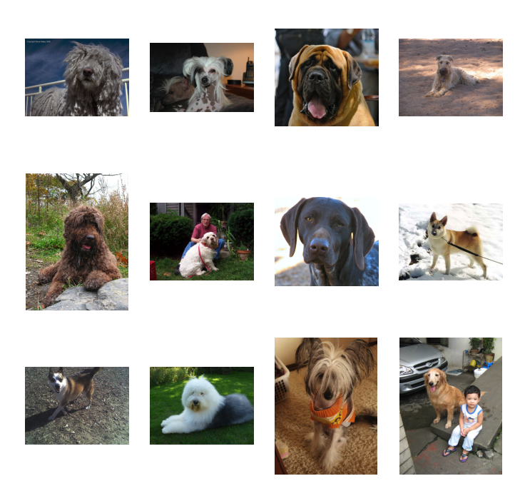
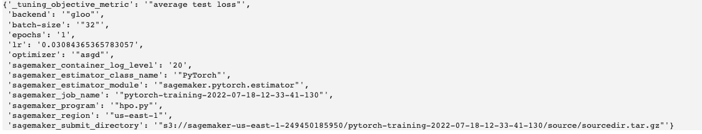
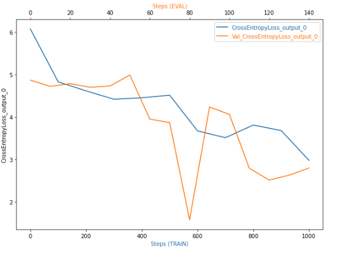
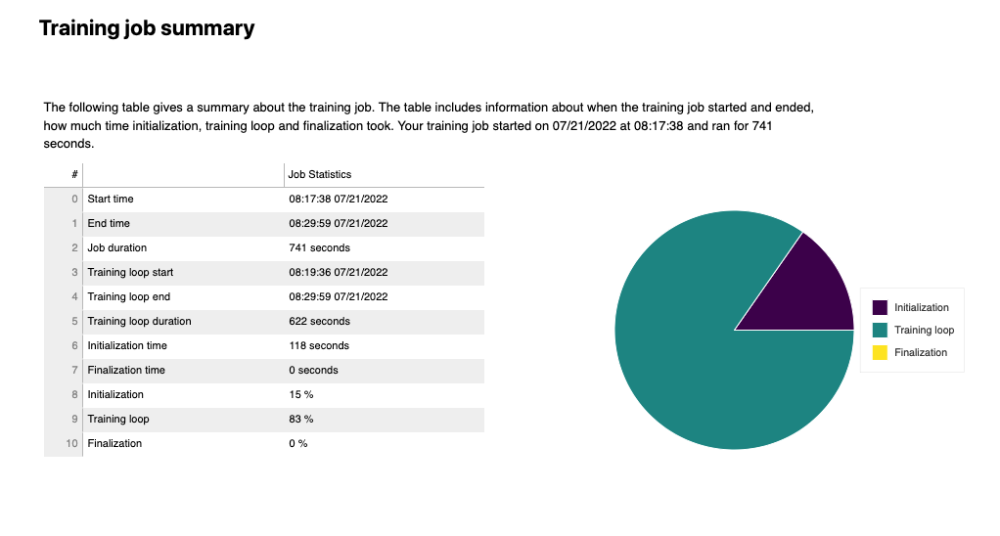
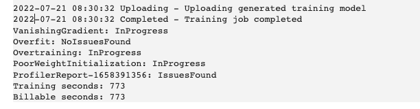
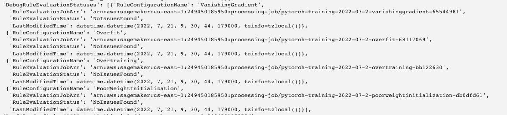
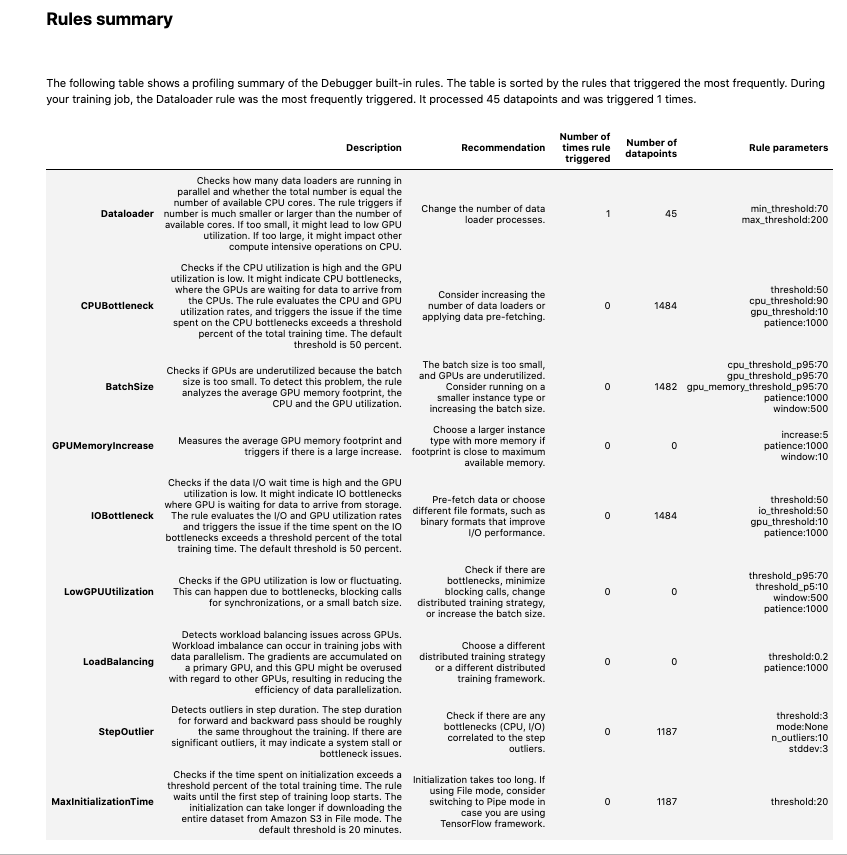
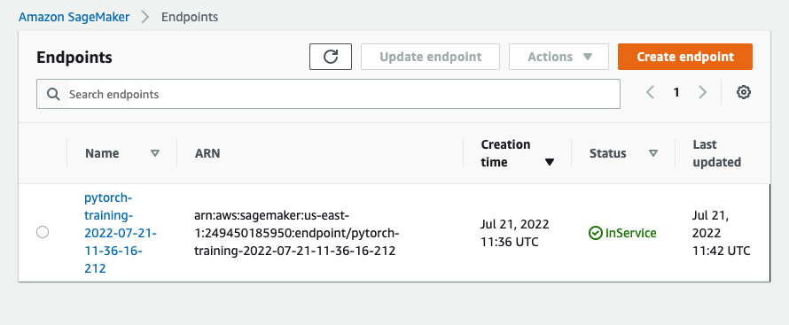
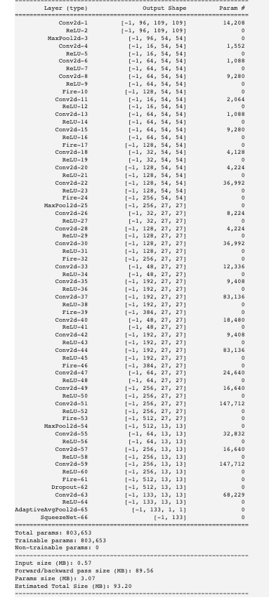
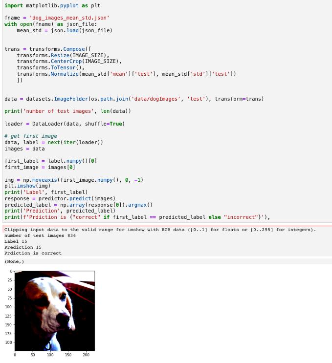

# Image Classification using AWS SageMaker

AWS Sagemaker is used to to train a pretrained model that can perform image classification by using the Sagemaker profiling, debugger, hyperparameter tuning and other good ML engineering practices. 

The objective of the project is not to create the best trained model, but rather demonstrate the techniques and tools that can be used to create, profile, debug, deploy and use a model using the AWS SageMaker infrastructure. In that context the specific neural network chosen is not important.

I have also taken the opportunity to experiment with pytorch's new datapipes when accessing training and test data. 

SageMaker's Debugger has been used to instrument training so that any issues can be more easily identified and corrected.

The images used are different dog breeds, like the ones below.

The project uses PyTorch to perform the ML operations.

If you just want to learn more about this project with installing or running anything I suggest you just click on train_and_deploy.ipynb which is rendered in github.

## Project Set Up and Installation
You can either use this project in conjunction wuth SageMaker Studio or run the notebook locally just utilising AWS infrastructure as required.

If using SageMaker Studio log into AWS and go to the SageMaker Studio. There you can clone this repository and run the train_and_deploy.ipynb notebook.

If you choose to run the notebook locally you will need to install conda/miniconda and install the required packages. I would recommend using miniconda (https://docs.conda.io/en/latest/miniconda.html). The required packages are included in the notebook.

## Dataset
The dataset used is that of dog breeds. There are separate folders for train, validate and test. In each of these folders there are separate folders for the different dog breeds. Images organised in this structure, with the labels effectively being the folder names is supported in PyTorch by the ImageFolder (https://pytorch.org/vision/stable/generated/torchvision.datasets.ImageFolder.html) which makes handling this data structure straight-forward.

The images are of different sizes and as part of the transformation process are resized to the image size for pretrained models, namely 224.

### Access
The data will need to be downloaded locally to the notebook (local machine or in SageMaker Studio) and uploaded to S3. There are functions defined in the notebook to do this. If the data has already been uploaded to S3 it is not uploaded again, but the S3 uri returned.

## Hyperparameter Tuning
The project uses the SqueezeNet neural network (https://arxiv.org/abs/1602.07360) which offers AlexNet levels of performance, but with considerably fewer parameters (50x less). It is also one of the pretrained torchvision models.

Hyperparamter tuning is a technique to find the best hyperparameters to train your model with. Whilst there are many hyperparameters I have decided to just tune three parameters:
- learning rate
- batch size
- optimizer

which according to this article [Tune an Image Classification Model](https://docs.aws.amazon.com/sagemaker/latest/dg/IC-tuning.htmlhttps://docs.aws.amazon.com/sagemaker/latest/dg/IC-tuning.html) have the biggest impact for image classification jobs.

More detail is shown in the test_and_deploy.ipynb notebook, but I've taken an image from there to show the best hyperparameters.

## Debugging and Profiling
With the best hyperparameters determined (given the training time and selection hyperparameters), I trained a model using these hyperparameters, with AWS profiling enabled and debugging hooks in place (in the associated training script).

I specifically monitored for the following possible issues:

- vanishing gradient
- overfitting
- overtraining
- poor weight initialization

#### Vanishing gradient
Vanishing gradient is when a neural network is unable to propagate useful gradient information to to layers near the input end of the network. This means the network is unable to learn from the given dataset. A common solution to this problem is to use the rRectified Linear Unit activation function (ReLU).

#### Overfitting
Overfitting means that the model is too closely aligned to the input data, but does not generalise well to other data given. There are a number of techniques that could be used to avoid overfitting:

***Increase the training data***

Although often not possible, increasing the training data is likely to help with overfitting as more examples are likely to provide greater variety.

***Reduce complexity of the model***

A greater number of layers enables the model to more closely fit the training data, this may result in a accurate model, but it may also result in one that closely matches the training data, but does not generalise well.

***Other techniques that can be tried include***:
- Weight Regularization: weight regularization, or weight decay is where the model is penalised based on the magnitude weights.
- Activity Regularization: Penalise the model during training base on the magnitude of the activations.
- Weight Constraint: Constrain the magnitude of weights to be within a range or below a limit.
- Dropout: Probabilistically remove inputs during training.
- Noise: Add statistical noise to inputs during training.

#### Overtraining
Overtraining means that the the model is overfitting the test data The most common solution is early stopping. So to stop training when the performance of the validation starts to degrade.

### Results

The full profiling report is available in the train_and_deploy notebook, but I've included here a few snippets.

### Loss during training

As can be seen in the screenshot below no issues were found with with these.

The one rule that was triggered was that the number of data loader processes could be increased.

## Model Deployment

The train_and_deploy notebook shows how the trained model is deployed and the endpoint queried.

The image below shows the deployed endpoint in SageMaker

### Model summary

### Make a prediction
Below shows how to make a prediction and the results

## Standout Suggestions

- I experimented the latest PyTorch Datapipes in order to determine means and standard deviations of the images.
- Updated the script via the model to make this a simpler process.

